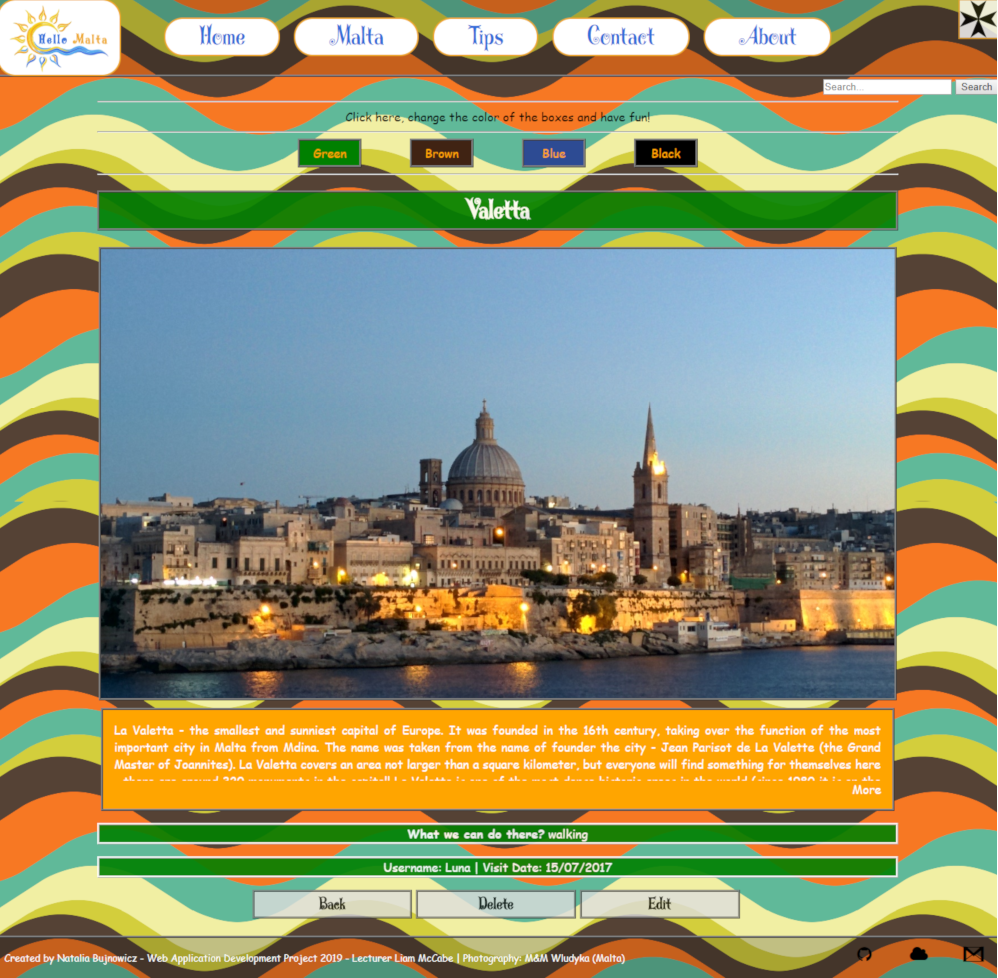

### Web Application Development (Project 2019) 
### ‘Hello Malta’ - share your experience 

#### Used technologies: HTML5, CSS3, JS+jQuery, Node.js+Express.js, MySQL, JSON. This application was built on Cloud9 application platform. 

##### INDEX PAGE 
###### jQuery Effects: show/hide header (by clicking the maltese cross); responsive menu; user can change the color of individual boxes; the one part of txt in the main header is changing every 1second (Hello/Enjoy/Visit/Love Malta); show/hide main text; responsive slider with amazing photos.
###### Search bar connected with SQL database.

##### MALTA PAGE 
###### jQuery Effects: menu effects + search bar (as above); the one part of txt in the main header is changing every 0,5second (maltese cities); see more/less description.
###### SQL database with validation, CRUD functionality and security. 

##### SHOW1 PAGE 
###### jQuery Effects: menu effects + search bar (as above); see more/less description.
###### SQL database with validation, CRUD functionality and security. 

##### CONTACT PAGE 
###### jQuery Effects: menu effects + search bar (as above); show/hide comments.
###### JSON with validation, CRUD functionality and security. 

##### ABOUT PAGE 
###### jQuery Effects: menu effects + search bar (as above); access to 2 boxes - on the left side are 4 buttons, after clicking one of them the content on the right is changing; gallery effect: the big picture changes when you click a small picture.

